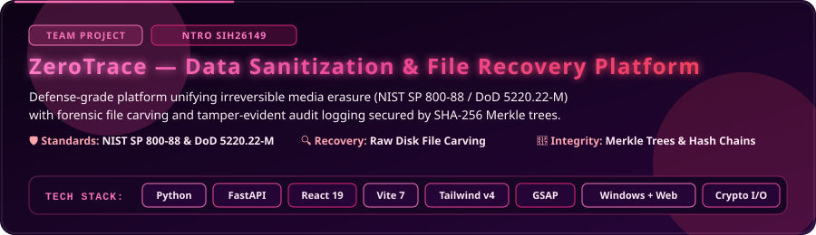
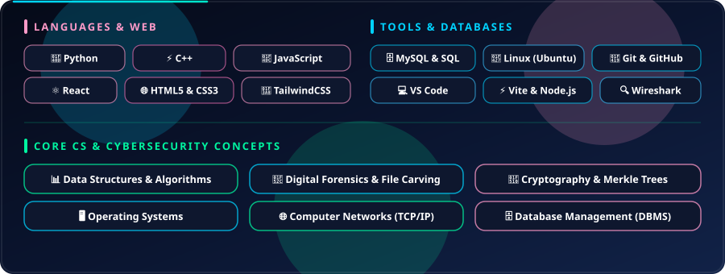

 

## 🌟 About Me

  

 

- 🎓 **B.Tech student (4th year)** at Chhatrapati Shahu Ji Maharaj University, Kanpur
- 🔐 **Cybersecurity enthusiast** passionate about digital forensics, secure software, and DSA
- 🌱 Constantly learning advanced **Data Structures & Algorithms** and system security
- 🧩 Contributing to **ZeroTrace** — a defense-grade sanitization & forensic recovery platform
- 🤝 Open to collaborating on cybersecurity challenges, digital forensics, and full-stack projects

## 🏆 Achievements

  

## 🚀 Project I'm Working On

### 🧩 ZeroTrace (Team Project)

  

 

**ZeroTrace** unifies irreversible media erasure and forensic-grade data recovery into a single tamper-evident ecosystem. Engineered for defense agencies, law enforcement digital forensic units, and enterprise cybersecurity operations addressing the **NTRO SIH26149** problem statement.

<b>📖 Comprehensive Project Description</b>

 

- **Irreversible Media Sanitization**: Defense-grade physical and logical data wiping aligned with **NIST SP 800-88 Rev. 1** (Purge & Clear) and **DoD 5220.22-M** standards.
- **Forensic File Recovery**: In-depth file carving reconstructing corrupted, formatted, or deleted files from raw disk sectors without relying on filesystem metadata.
- **Tamper-Evident Audit Logging**: Cryptographically verifiable chain of custody generated using **SHA-256 Hash Chains** and **Merkle Trees** to guarantee non-repudiation.
- **Dual Platform Architecture**: Standalone low-level **Windows Desktop Application** for raw storage operations coupled with a modern real-time **Web Dashboard**.

<b>🛠️ ZeroTrace Tech Stack</b>

 

- **Core & Backend**: Python 3.11, FastAPI, Raw Disk I/O, Asyncio
- **Frontend & UI**: React 19, Vite 7, TailwindCSS v4, GSAP Animations
- **Forensic & Cryptographic Engine**: File Carving Algorithms (Scalpel/Foremost style), Cryptographic Merkle Trees, SHA-256 Hashing, NIST SP 800-88 / DoD 5220.22-M Sanitization Protocols
- **Deployment & Tooling**: Windows Native Tooling, Vercel, Git & GitHub

## 🛠️ Skills & Core Concepts

  

## 📊 GitHub Stats

 

## 🐍 Contribution Snake

<picture>
  <source media="(prefers-color-scheme: dark)" srcset="https://raw.githubusercontent.com/jainshreya2004/jainshreya2004/output/github-contribution-grid-snake-dark.svg">
  <source media="(prefers-color-scheme: light)" srcset="https://raw.githubusercontent.com/jainshreya2004/jainshreya2004/output/github-contribution-grid-snake.svg">
  
</picture>

## 📫 Let's Connect

  <em>Always excited to connect, collaborate on cybersecurity &amp; web projects, or discuss tech!</em>

  
  &nbsp;&nbsp;
  
  &nbsp;&nbsp;
  

 

